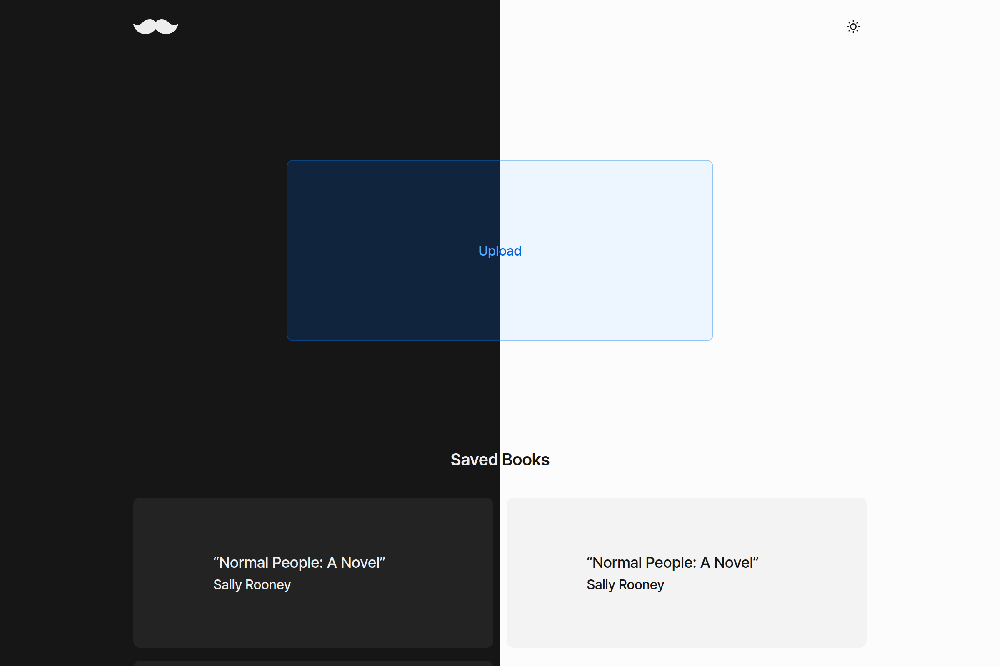

# flaub 

> EPUB parser and reader, built using React, Vite, and the lovely DOMParser.

Flaub is a browser-based EPUB parser and reader. It unzips, parses, and caches your EPUB file and allows you to easily read it. It's still a work in progress as I read more books and unravel more bugs. **[Try it out!](https://flaub.vercel.app)**

Feel free to fork it or contribute.

## Backstory

I couldn't get a single EPUB reader to work on my Ubuntu, and you know what's the smartest thing to do when that happens? Yes—creating your own reader.

The parser is inspired by [epub-parser](https://github.com/gaoxiaoliangz/epub-parser), except that it doesn't offer as many options and it relies on the browser's DOMParser. The latter turned out to be really sweet to work with since all you need to know is how to use `querySelector`.

It's named Flaub 'cause Flaubert. Here's a moustache. I couldn't find one that looks like Flaub's.

## Features

- Dark mode (thanks to Radix UI Colors and next-themes)
- Caching (uses IndexedDB to avoid parsing files again)
- Saving scroll position
- Pretty reading experience (thanks to Raster.css)

## License

MIT License © 2021 [Imed Adel](https://github.com/imedadel)
